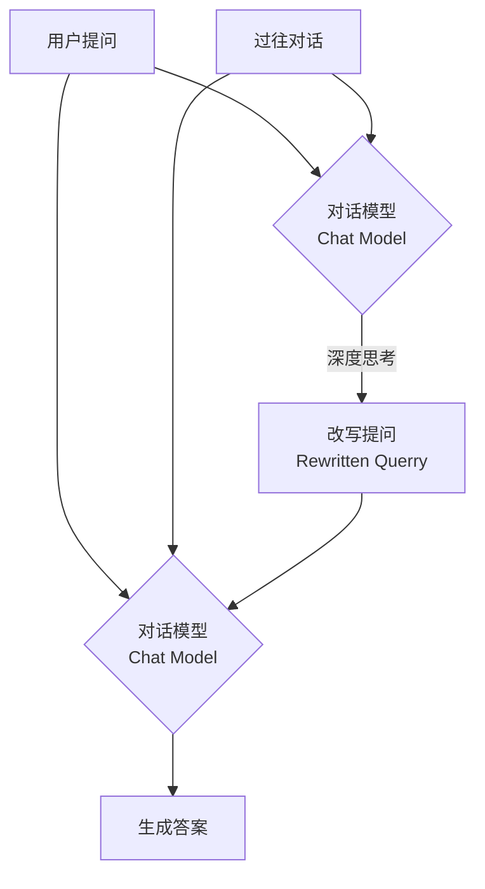
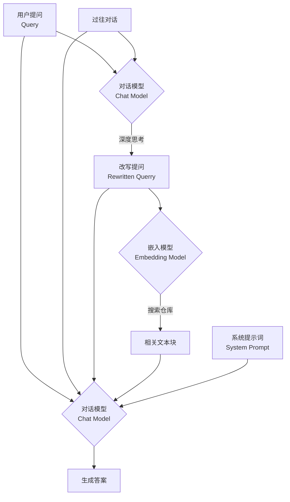

# AI学习助手完整使用文档

## 目录

```table-of-contents
```

# 第一部分：基础功能 (V1.01)

## 1 简介
AI学习助手是一款集AI问答、阅读、笔记于一体的学习辅助软件，目前已更新至1.1版本。有了AI帮忙，加上一个简单好用的书籍、笔记系统，对于学习晦涩复杂的知识体系，比如哲学、政治经济学、精神分析、计算机原理、包括AI技术本身会更直白、高效、成体系。

AI学习助手的主要功能是基于一款笔记软件，Obsidian。AI学习助手集成了学习资料、笔记功能、AI功能等。

## 2 下载与安装
通过百度云盘下载AI学习助手1.0
链接: https://pan.bAIdu.com/s/1qaMruokoMFrY7vjlzlBIVA?pwd=7exm 
提取码: 7exm

打开下载好的文件夹，双击进入相关软件安装包。文件夹中包含多个文件，其中有一个红色圆圈标记的"相关软件安装包"文件夹。

双击运行Obsidian-1.8.10.exe，安装软件。在软件列表中找到"Obsidian-1.8.10.exe"文件（显示为应用程序，约260.416 KB大小）。

安装Obsidian笔记软件，建议不要安装在C盘。安装程序会显示"选择安装位置"对话框，包含以下选项：
- 目标文件夹：默认为"F:\Programs\Obsidian"（可以修改）
- 浏览按钮：用于选择其他安装路径
- 所需空间：297.5 MB
- 可用空间：149.1 GB
- 版本信息：Obsidian 1.8.10
- 底部按钮：上一步、安装、取消

[!info] 如果你已经安装Obsidian，请跳过安装步骤。打开你的Obsidian，在**设置-关于**页面，确保你安装的是v1.8.10最新版本。在"关于"页面中：
- 左侧菜单显示各个设置选项（关于、编辑器、文件与链接、外观、快捷键、核心插件、第三方插件）
- 当前版本：v1.8.10（红色框标出）  
- 包含更新链接和语言设置
- 右上角有"检查更新"按钮（红色框标出）
- 自动更新功能可以开启或关闭
- 语言设置为"简体中文"

## 3 初步配置AI学习助手

>[!tip] AI学习助手软件设置参考视频：[【录播剪辑】AI学习助手1.0-软件设置_哔哩哔哩_bilibili](https://www.bilibili.com/video/BV1xbLizPEh3/?spm_id_from=333.337.search-card.all.click&vd_source=9de7c3a67fd42814f6579e0482d4d3ad)

### 3.1 配置文件仓库
安装好Obsidian后，接下来我们要配置好Obsidian仓库。首先，新建一个空的文件夹，文件夹名不限（示例为Obsidian vaults），该文件夹主要用于放置AI学习助手相关文件，建议不要放置在C盘。在文件管理器中，你会看到新创建的"obsidian vaults"文件夹与其他文件夹（如"ht_cache"、"视频项目"）并列显示。

接下来，回到下载好的AI学习助手文件夹，将该文件夹整个拷贝到刚才创建的空的文件夹（示例为Obsidian vaults）中。在文件列表中可以看到：
- AI学习助手-1.0.1（文件夹，修改日期：2025/5/7 19:50）
- 柯察【AI学习助手-1.0】文件夹（修改日期：2025/5/7 19:48）
- 相关软件安装包（文件夹，修改日期：2025/5/7 19:50）

将AI学习助手-1.0.1文件夹复制粘贴到Obsidian vaults文件夹中。

接下来，就可以打开Obsidian软件，在软件内配置AI学习助手，打开Obsidian并选择语言。
>[!info] 注意：由于大量第三方插件未进行本地化，因此改语言选项仅能改变Obsidian的语言设置以及自带本地化的插件。

首次启动Obsidian时，会显示欢迎界面，包含：
- Obsidian紫色钻石Logo和版本号（Version 1.8.10）
- Quick start按钮（快速开始）
- Create new vault：创建新仓库选项，包含"Create"按钮
- Open folder as vault：打开文件夹作为仓库，包含"Open"按钮
- Open vault from Obsidian Sync：从同步服务打开仓库，包含"Sign in"按钮
- 底部语言选择框：默认为"English"（红色框标出），可以点击更改为简体中文

选择语言后，点击"打开本地仓库"（Open folder as vault），在文件选择器中导航到Obsidian vaults文件夹，选择其中的AI学习助手-1.0.1文件夹。文件选择器显示：
- 导航路径：此电脑 > 本地磁盘 (E:) > obsidian vaults
- 文件列表中的"AI学习助手-1.0.1"文件夹（红色框标出）
- 底部选择区域显示"文件夹: AI学习助手-1.0.1"
- 右下角"选择文件夹"按钮（红色框标出）

### 3.2 加载AI学习助手
首次加载AI学习助手时，软件会弹出信任仓库作者的安全确认对话框。对话框标题为"你是否信任这个仓库的作者？"，内容说明：
- 这个仓库内容未知，并且覆盖了一些插件
- 请注意，未知来源的插件将带来数据和隐私风险
- 如果你不信任这仓库的作者，建议你在安全模式中打开这仓库，以防止仓库中插件运行
- 底部有两个按钮："信任仓库作者并启用插件"（红色框标出）和"在安全模式中打开这仓库"

接下来，AI学习助手的相关内容会显示在Obsidian的左边栏，包括：
- 随笔·白板
- 学习资料（红色框标出的区域包含）
- 阅读笔记
- AI对话自动存档
- AI快捷指令
- Y-导入笔记
- Z-附件资料夹

底部显示当前仓库名称"AI学习助手-1.0.1"（红色框标出）。

右侧还显示AI助手界面，包含相关笔记（Relevant Notes）和建议提示（Suggested Prompts）等功能区域。

之后要选择、添加、删除、重命名仓库，点击左下方的仓库管理按钮即可。

至此，AI学习助手的本体已经安装好了。你现在已经可以阅读学习资料文件夹里面的哲学、历史、政治经济学教材和书籍，后续还会添加精神分析基础、数学物理、AI辅助编程、AI与计算机技术等资料。

## 4 Obsidian使用指南
Obsidian本体的功能很多，对于AI学习助手的使用无需再进行手动配置，直接开始上手摸索即可。

>[!info] Obsidian软件的使用手册可以参照以下链接：
>[由此开始 - Obsidian 中文帮助 - Obsidian Publish](https://publish.obsidian.md/help-zh/%E7%94%B1%E6%AD%A4%E5%BC%80%E5%A7%8B)

Obsidian主界面主要分左边栏，主体，右边栏：

**Obsidian主界面布局说明**：
- **最左边一列**：插件栏，包含各种功能插件的快捷按钮
- **左侧区域**：仓库的文件浏览器，显示文件夹结构和文件列表
- **主体部分**：文件显示的位置，即看书、写笔记的主要工作区域
- **右边栏**：包含大纲、AI对话框等辅助功能面板

### 4.1 自带功能
#### 4.1.1 基础设置
点击Obsidian左下角的**齿轮按钮**打开设置页面，设置界面结构如下：

**Obsidian设置页面结构**：
- **左侧设置菜单**（按顺序排列）：
  - **基础设置区域**（红框标出）：
    - 关于 - 版本信息和语言设置
    - 编辑器 - 编辑相关设置  
    - 文件与链接 - 文件管理设置
    - 外观 - 主题和界面设置
    - 快捷键 - 键盘快捷键配置
  - **核心插件** - Obsidian内置插件管理
  - **第三方插件** - 社区插件管理
  
- **右侧内容区域**：显示当前选中设置项的具体配置选项
- **底部**：左下角有设置齿轮图标（红框标出）用于返回主界面

以下是一些比较重要的基础设置：

##### 4.1.1.1 关于
用于检查更新、调整语言等功能

##### 4.1.1.2 编辑器
用于编写文档的设定。Obsidian标准格式叫markdown（.md）格式，特点是用代码表达格式。*比如给一句话加斜体，只要在句子两端加一个星号。* 

**查看Markdown源码的操作步骤**：
1. 在文件窗口的右上角找到三个点的菜单按钮
2. 点击菜单中的"源码模式"选项
3. 即可查看当前文档的markdown格式源代码

**Markdown源码示例**：
```markdown
# 一级标题
## 二级标题
*斜体文字*
**粗体文字**
- 无序列表项
1. 有序列表项
[链接文字](链接地址)
```

用Obsidian写笔记需要使用markdown语言，对于格式的调整需要通过源码的方式进行设置，对于初学者不太友好，因此，AI学习助手默认添加了第三方插件Editing Toolbar，可以像编辑word文档一样修改、添加格式了。

**Editing Toolbar工具栏功能说明**：
- 工具栏位于编辑器顶部，包含常用格式化按钮
- 包含粗体、斜体、标题、列表、链接等快捷格式按钮
- 支持一键插入表格、代码块、引用等markdown元素
- 提供所见即所得的编辑体验，无需手动编写markdown语法
关于Editing Toolbar，请参考：[[#4.2.1 Editing Toolbar 格式工具栏]]。
学习更多markdown语法，请参考：[Markdown 链接语法 | Markdown 教程](https://markdown.com.cn/basic-syntax/links.html)

##### 4.1.1.3 外观
**外观设置页面操作步骤**：
1. 在设置页面左侧菜单中点击"外观"选项
2. 在右侧内容区域找到"主题"部分
3. 点击"管理"按钮即可进入主题选择界面

**主题浏览与下载界面**：
- **主题列表**：显示各种可用的Obsidian主题，包括深色、浅色等不同风格
- **预览功能**：可以预览每个主题的效果
- **一键安装**：点击喜欢的主题名称，系统会自动下载并应用
- **立即生效**：下载完成后主题即刻应用到整个Obsidian界面

##### 4.1.1.4 文件与链接
该页面主要设置新建或删除文档位置。

**文件与链接设置的重要配置**：

**（1）新建笔记的默认位置设置**：
- **配置项**："新文件的默认位置"
- **默认设置**：`随笔·白板`文件夹
- **功能说明**：所有新创建的笔记文件都会自动保存到此文件夹中

点击左上角按钮X，可以退出设置。在AI学习助手仓库里面，就可以看到`随笔·白板`文件夹。所有新创建的笔记、白板都放在这里。
**随笔·白板文件夹在界面中的位置**：
- 位于左侧文件浏览器的根目录下
- 文件夹图标为文件夹形状，有清晰的文字标识
- 可以展开查看内部的所有笔记文件
- 支持拖拽操作来组织文件结构

在系统文件浏览器里面，也可以找到`随笔·白板`文件夹。
**在系统文件浏览器中的位置**：
- 可以在操作系统的文件管理器中找到`随笔·白板`文件夹
- 路径位于：[Obsidian仓库根目录]/随笔·白板/
- 支持直接在文件管理器中编辑、复制、移动文件
- 与Obsidian内部的文件显示保持同步

**（2）附件文件的默认存储位置**：
- **附件类型**：除了笔记以外的所有文件，包括图片、音频、视频、PDF等
- **存储位置**：`Z-附件资料夹/附件材料`文件夹
- **自动管理**：系统会自动将所有附件统一存储到此位置
- **双向访问**：在AI学习助手侧边栏和系统文件浏览器中都可以访问
- **组织结构**：保持仓库整洁，方便管理和备份

**Z-附件资料夹的功能特点**：
- 统一管理所有非文本文件
- 便于批量备份和整理
- 避免附件散布在各个文件夹中
- 支持子文件夹分类存储

##### 4.1.1.5 快捷键
快捷键一栏可自行设定Obsidian软件的快捷键。

#### 4.1.2 核心插件
核心插件是Obsidian自带的一些功能，可以在核心插件页面选择打开或关闭

**核心插件管理界面**包含以下功能：
- **左侧菜单**：显示"核心插件"被选中（红框标出）
- **右侧插件列表**：显示所有可用的核心插件，每个插件都有开关按钮控制启用/禁用状态：
  - 白板 (Canvas) - 用于创建可视化笔记布局
  - 笔记重组 (Note composer) - 重新组织笔记结构  
  - 标签列表 (Tag pane) - 显示和管理标签
  - 出链 (Outgoing links) - 显示当前笔记的外向链接
  - 大纲 (Outline) - 显示笔记的标题结构
  - 发布 (Publish) - 用于发布笔记到Obsidian Publish
  - 反向链接 (Backlinks) - 显示引用当前笔记的其他笔记
  - 工作区 (Workspaces) - 管理不同的工作区布局
  - 关系图谱 (Graph view) - 显示笔记之间的关联图
  - 幻灯片 (Slides) - 将笔记转换为演示文稿
  - 快速切换 (Quick switcher) - 快速搜索和打开笔记
  - 录音机 (Audio recorder) - 录制音频笔记

>[!tip] 上手即用
>AI学习助手1.01已经帮大家打开实用的核心插件，无需自己设置

**核心插件的详细设置区域**：
- **位置**：在设置页面的核心插件标签下方
- **内容**：展示所有已启用的核心插件的具体设置选项
- **功能**：可以对每个已启用的插件进行个性化配置
- **分类显示**：按插件类型分组显示，方便查找和调整

##### 4.1.2.1 白板
白板是一个无限大的平面，可以把你的笔记、PDF拖到里面，帮你构建关系图。

**创建白板的操作步骤**：
1. 在左侧插件栏中找到白板创建按钮（四个小方框的图标）
2. 点击该按钮即可创建新的白板
3. 系统会自动打开新的白板编辑界面
4. 可以在白板上自由放置文字、图片、笔记链接等元素
白板默认储存位置是`随笔·白板`文件夹。

##### 4.1.2.2 模板
模板插件可以帮你快速插入模板里面的文本。模板都储存在`Z-附件资料夹/模板`里面。
**使用模板的操作步骤**：
1. 在笔记中将光标定位到想要插入模板的位置
2. 在左侧插件栏中找到**插入模板**按钮
3. 点击按钮后会弹出模板选择菜单
4. 从可用模板列表中选择所需的模板
5. 模板内容会自动插入到当前光标位置
**模板插入成功后的显示效果**：
- 模板内容会直接显示在笔记中的指定位置
- 保持模板的原有格式和结构
- 可以在插入后继续编辑和修改内容
- 支持多个模板的组合使用

##### 4.1.2.3 文件恢复
**文件恢复功能使用步骤**：
Obsidian会即时储存你的修改，但如果想恢复文件到之前状态：
1. 在左侧插件栏中找到文件恢复按钮
2. 点击**文件恢复-浏览**按钮
3. 系统会打开文件恢复界面，显示可恢复的文件列表

**选择要恢复的文件**：
- **文件列表**：显示所有有历史版本的文件
- **文件信息**：包含文件名、修改时间等详细信息
- **选择操作**：点击想要恢复的文件名称
- **版本显示**：可以看到每个文件的历史版本数量

**选择具体的恢复时间点**：
- **时间列表**：显示选中文件的所有历史版本时间点
- **版本信息**：每个时间点显示具体的修改日期和时间
- **预览功能**：可以预览每个版本的内容差异
- **恢复操作**：点击所需的时间点即可恢复到该版本
- **安全提示**：恢复操作会覆盖当前版本，操作前需要确认

### 4.2 第三方插件
第三方插件是社区爱好者编写的功能，
**启用第三方插件的步骤**：
启用第三方插件，首先要**关闭安全模式**：
1. 进入设置页面，点击左侧菜单中的"第三方插件"
2. 在第三方插件页面顶部找到"安全模式"设置
3. 点击"关闭安全模式"按钮
4. 系统会提示安全风险，确认后即可关闭

**管理单个第三方插件**：
- **插件列表**：在第三方插件页面中显示所有已安装的第三方插件
- **开关按钮**：每个插件右侧有开关按钮，可以单独启用或禁用
- **插件信息**：包含插件名称、作者、版本号等详细信息
- **即时生效**：开关操作后立即生效，无需重启Obsidian

>[!tip] 开箱即用
>第三方插件中，除了copilot比较特殊，需要用户自行加载AI模型，其他都基本设置好了，开箱即用。

**第三方插件的详细设置区域**：
- **位置**：在设置页面左下方**第三方插件**区域下方
- **内容**：列出所有已启用的第三方插件及其设置选项
- **功能**：点击任意插件名称可进入该插件的具体配置页面
- **分类显示**：按插件类型和功能进行分组显示

>[!attention] 只有在**第三方插件**标签页中打开的插件才会显示到**设置页左下方**和**左边栏**里面：
**第三方插件打开状态的显示**：
- **启用标识**：已启用的插件在名称右侧显示绿色开关
- **禁用标识**：未启用的插件在名称右侧显示灰色开关
- **状态同步**：该页面的设置会直接影响左下方设置区和左侧插件栏的显示

下面是一些第三方插件功能简单介绍。

#### 4.2.1 Editing Toolbar 格式工具栏

**Editing Toolbar格式工具栏的功能特点**：
**Editing Toolbar**可以让用户像编辑word文档那样修改文字的格式。

**工具栏界面说明**：
- **位置**：位于编辑器顶部，紧邻文档标题栏
- **格式按钮**：包含粗体(B)、斜体(I)、删除线、高亮等常用格式
- **结构按钮**：支持插入标题、列表、表格、代码块等
- **快捷操作**：点击即用，无需记忆markdown语法

#### 4.2.2 Floating Toc 悬浮目录
**Floating Toc悬浮目录的显示效果**：
悬浮目录会自动读取当前文档的标题，在右边生成一个**大纲**的悬浮窗。

**悬浮目录界面特点**：
- **位置**：默认显示在编辑器右侧，可拖拽定位
- **层级结构**：按照标题级别（H1、H2、H3等）展示目录结构
- **快速导航**：点击目录项可快速跳转到对应段落
- **实时更新**：文档标题变化时自动更新目录

主要功能：
**1）展开收起大纲功能**：
- **操作方式**：点击浮动大纲右上角的小箭头按钮
- **收起状态**：点击后目录面板会折叠为小图标
- **节省空间**：收起后可以获得更大的编辑区域
- **快速展开**：再次点击可快速展开目录

**收起后的大纲显示效果**：
- **简化图标**：收起后只显示一个小的目录图标
- **位置固定**：保持在原有位置，不占用额外空间
- **功能保持**：虽然收起但功能仍可正常使用
- **视觉清洁**：减少视觉干扰，便于专注写作

**2）复制大纲功能**：
- **操作方式**：点击悬浮目录中的复制按钮
- **复制内容**：会复制当前文档的完整目录结构
- **格式保持**：复制的目录保持markdown格式，可直接粘贴使用
- **应用场景**：适用于制作文档索引或分享给他人

**替代方式打开大纲**：
关掉floating toc后，如需打开大纲：
1. 点击界面右上角的**右边栏**按钮
2. 在右边栏中找到并点击**大纲**按钮
3. 大纲面板会在右侧边栏中打开
4. 此方式打开的大纲与Floating Toc功能相同，但位置固定

#### 4.2.3 Minimal Theme Settings 极简外观设定
**Minimal Theme Settings启用后的效果**：
该插件是Obsidian的极简外观**改变字体颜色**的插件，打开之后，文档的**不同级别标题会自动变色**，方便阅读。

**启用后的标题颜色效果**：
- **一级标题(H1)**：显示为鲜明的蓝色
- **二级标题(H2)**：显示为深绿色
- **三级标题(H3)**：显示为橙色
- **四级及以下标题**：使用不同深浅的颜色区分
- **层次清晰**：不同级别的标题一目了然，便于快速定位

**关闭后的显示效果**：
关闭Minimal Theme Setting后，所有标题恢复为默认颜色：
- **统一颜色**：所有标题显示为相同的白色或主题默认颜色
- **层次不明**：难以快速区分不同级别的标题
- **阅读体验**：相比开启时的彩色效果，阅读体验有所下降

>[!attention] 注意：这个插件只对Minimal外观有作用。更换成其他外观，插件会失效。

#### 4.2.4 Excalidraw 手绘板
**Excalidraw手绘板的使用方式**：
Excalidraw是一款**白板绘图工具**，支持手绘板笔记等功能，有手绘板且喜欢手写笔记的朋友可以使用。

**启动方式**：
1. 在左侧插件栏中找到**钢笔**图标按钮
2. 点击按钮即可启动Excalidraw绘图界面

**主要功能**：
- **自由绘图**：支持手绘、线条、形状、文字等元素
- **手写支持**：特别适合使用手写板或触控笔
- **无限画布**：提供无限大小的绘图区域
- **实时协作**：支持多人实时协作编辑

>[!tip] 配合手写板，体验更佳。

#### 4.2.5 Media Extended 多媒体浏览
**Media Extended多媒体浏览功能**：
Media Extended插件可以直接**用Obsidian浏览**网络或本地的**视频**。

**使用步骤**：
1. 在左侧插件栏中找到播放按钮（三角形图标）
2. 点击按钮后会弹出输入框
3. 在输入框中粘贴视频链接（支持B站、YouTube等平台）
4. 确认后即可在Obsidian内播放视频

**支持的平台**：
- **B站**：支持哔哩哔哩视频直接播放
- **YouTube**：支持YouTube视频嵌入
- **本地文件**：支持本地MP4、MOV等格式

**视频内嵌播放效果**：
- **无缝集成**：视频直接嵌入到Obsidian编辑器中
- **播放控制**：支持暂停、播放、音量调节等基本操作
- **笔记结合**：可以在视频下方直接做笔记，实现学习和记录的统一
- **时间戳记**：可以记录特定时间点，方便后续复习

#### 4.2.6 PDF ++ 
PDF++插件可以帮助给PDF文件写笔记，提升阅读体验。
打开一个PDF文件后，PDF ++ 的主要功能集中在上方**工具栏**和**鼠标右键**选项：

**PDF++工具栏界面说明**：
- **位置**：PDF文件上方的工具栏区域
- **主要功能按钮**：从左到右依次为
  - **Selection工具**：用于选择PDF文本内容
  - **Note工具**：添加注释功能
  - **Highlight工具**：高亮标记功能
  - **Copy工具**：复制选中内容
  - **Translate工具**：翻译选中文本
- **右键菜单**：在PDF文本上右键可显示快捷操作菜单
- **功能特色**：工具栏提供了完整的PDF阅读和笔记功能，支持文本选择、复制、翻译等操作

使用方法：打开PDF书籍和对应的笔记，选中要翻译、关键点、灵感或者其他段落，选择你要粘贴的方法，我这里选择了复制原文和页码：

**PDF++复制操作界面说明**：
- **操作步骤**：
  1. 在PDF中选中需要复制的文本段落
  2. 右键点击选中的文本
  3. 在弹出的右键菜单中选择复制选项
- **复制选项**：
  - **Copy Text**：仅复制选中的文本内容
  - **Copy Text + Page**：复制文本内容并附带页码信息
  - **Copy as Quote**：以引用格式复制文本
- **界面特点**：右键菜单会显示在选中文本附近，提供多种复制格式选择
- **推荐设置**：建议选择"Copy Text + Page"以便保留页码引用信息

点击page，这段话就会被粘贴到对应的笔记中，并附带生成页码的链接，点击页码可以直接打开对应书籍的指定页：

**PDF++粘贴结果界面说明**：
- **粘贴内容格式**：
  - **文本内容**：选中的PDF原文内容
  - **页码链接**：格式为"[页码]"的可点击链接
  - **完整格式**："原文内容 [页码]"
- **链接功能**：
  - 点击页码链接可直接跳转到PDF对应页面
  - 链接保持与原PDF文件的关联
  - 支持快速定位和回溯
- **显示效果**：
  - 文本内容以普通格式显示
  - 页码以蓝色超链接形式显示
  - 整体保持良好的阅读体验
- **应用场景**：适合做读书笔记、文献摘录、学术引用等

#### 4.2.7 Commander 添加命令
**Commander插件的作用和示例**：
Commander插件可以将常用的命令创建为快捷按钮，提高操作效率。

**示例功能说明**：
- **按钮位置**：位于界面右上角的工具栏中
- **命令内容**：**PDF++: create new note for auto-focus or auto-paste**
- **具体功能**：当阅读PDF书籍时，一键在`随笔·白板`文件夹中创建与当前PDF相关联的笔记文件

**Commander插件的优势**：
- **自定义按钮**：可以将任意命令添加为界面按钮
- **快速访问**：无需记忆快捷键或命令名称
- **个性化配置**：根据个人使用习惯定制工具栏
- **提高效率**：将复杂操作简化为一键操作

## 5 AI学习助手使用指南（基础版）

### 5.1 copilot插件介绍

> [!note] 
> AI学习助手的AI部分，主要通过Obsidian软件里面的第三方插件**copilot**实现。copilot的主要功能有：1）支持多种AI模型； 2）搜索仓库里面笔记，通过"Vault QA"功能整合分散内容，快速生成总结或回答复杂问题； 3）提供一键翻译、润色、生成表格等功能，用户可自定义常用指令模板（如"专业润色"），并储存快速调用，提升操作效率。
> 
> 视频参考：[【录播剪辑】AI学习助手1.0-原理及概念介绍_哔哩哔哩_bilibili](https://www.bilibili.com/video/BV1R6L8zhEuf/?spm_id_from=333.337.search-card.all.click&vd_source=9de7c3a67fd42814f6579e0482d4d3ad)

插件已经安装好了，我们需要加载模型。我们在设置里面打开**copilot**，点击copilot页面中的**model**标签。

**Copilot模型配置页面结构**：
- **页面位置**：设置 → 第三方插件 → Copilot → Model标签页
- **主要区域**：
  - **Chat Model区域**：用于配置对话模型，包含模型列表和添加按钮
  - **Embedding Model区域**：用于配置嵌入模型，包含模型列表和添加按钮
  - **配置按钮**：每个区域都有"Add Custom Model"按钮用于添加新模型
- **功能说明**：此页面是AI学习助手的核心配置区域，需要配置两种不同类型的模型才能正常使用

AI学习助手的正常使用需要配置两种模型，**对话模型（Chat Model)**和**嵌入模型（Embedding Model）**。上述两种模型的具体功能，请参考：[[#5.2 AI基本问答流程]]。

加载的模型可以用网上运营商提供的api，也可以用下载到本地的。考虑到大部分朋友电脑配置不好，**本使用手册采用网上运营商API完成模型加载**。

> [!note] 使用网络运营商的优缺点
> 优点：1、对电脑硬件要求低；2、运算速度快
缺点：1、收费，deepseek R1每个问题需要4分钱左右；2、隐私安全问题，嵌入模型会搜索AI学习助手仓库里面的所有文件，包括所有的笔记、心得。

若要使用本地模型，推荐使用LM Studio下载和管理本地模型的使用和加载，详细请参考：[[#6.1 LM Studio]]

#### 5.1.1 添加Chat Model
**添加Chat Model的操作步骤**：
1. 在Copilot设置页面的Model标签页中找到"Chat Model"区域
2. 点击该区域下方的"Add Custom Model"按钮
3. 系统会弹出自定义模型配置对话框

弹出的模型配置窗口包含以下配置项：

**添加自定义聊天模型配置界面**包含以下字段：
- **Model Name***（必填）：输入模型名称，例如 gpt-4
- **Display Name**（可选）：自定义显示名称，用于在界面中显示
- **Provider**：选择提供商类型，默认为 OpenAI
- **Base URL**：API接口地址，如 https://api.openai.com
- **API Key**：输入OpenAI API密钥，可点击"Get OpenAI API Key"获取
- **Model Capabilities**（模型能力）：
  - ☐ Reasoning（推理能力）
  - ☐ Vision（视觉能力）  
  - ☐ Websearch（网络搜索）
- **Additional OpenAI Settings**：额外的OpenAI设置选项
- **☐ Enable CORS**：启用跨域资源共享
- 底部有 **Add Model** 和 **Verify** 按钮用于添加和验证模型

配置以硅基流动API为例，请参考：[[#6.2 硅基流动]]

**模型名称配置**：
- **获取方式**：在硅基流动的模型广场中选择所需模型
- **复制操作**：点击模型名称右侧的复制按钮
- **名称示例**：deepseek-AI/DeepSeek-R1
- **注意事项**：必须复制完整的模型名称，包括组织名和模型名

展示名（**Display Name**）：向用户展示的名字，可自行设置，例如Siliconflow_deepseek-AI/DeepSeek-R1

**Provider提供商选择**：
- **选择原则**：根据模型提供商的API接口格式选择
- **常用选项**：
  - OpenAI Format：适用于兼容OpenAI API的提供商（如硅基流动）
  - Anthropic：适用于Claude系列模型
  - Google：适用于Gemini系列模型
- **推荐设置**：对于硅基流动等兼容平台，选择“OpenAI Format”

**Base URL基础地址配置**：
- **作用**：API请求的基础地址，指向模型提供商的服务器
- **硅基流动示例**：https://api.siliconflow.cn/v1
- **其他常用地址**：
  - OpenAI官方：https://api.openai.com/v1
  - 本地部署：http://localhost:1234/v1
- **注意事项**：必须以“/v1”结尾，且保证网络可访问

**API Key密钥获取和配置**：
- **作用**：用于身份验证的密钥，确保只有授权用户可以使用API
- **获取步骤**：
  1. 在模型提供商官网注册账号
  2. 进入API管理页面
  3. 点击"新建密钥"或"Create API Key"
  4. 设置密钥名称和权限
  5. 复制生成的密钥（仅显示一次）

**API密钥的复制和粘贴操作**：
1. **复制操作**：
   - 在模型提供商页面中找到新创建的API密钥
   - 点击密钥旁边的"复制"按钮
   - 系统会自动将密钥复制到剪切板
2. **粘贴操作**：
   - 返回Obsidian的模型配置窗口
   - 在"API Key"输入框中粘贴密钥
   - 确保密钥完整且格式正确

接下来，勾选**Reasoning**和**Enable CORS**两个选项。
>[!note]
Reasoning是表示添加的模型具有推理能力，即具有文字问答的能力。CORS是允许跨域资源共享（Cross-Origin Resource Sharing），即允许外部API访问。

**模型能力勾选界面说明**：
- **Reasoning选项**：
  - **位置**：在"Model Capabilities"区域内
  - **状态**：需要勾选（✓）
  - **作用**：启用模型的推理和文字问答能力
- **Enable CORS选项**：
  - **位置**：在"Additional OpenAI Settings"区域内
  - **状态**：需要勾选（✓）
  - **作用**：允许跨域资源共享，确保API正常访问
- **界面布局**：
  - 选项以复选框形式呈现
  - 勾选后会显示蓝色对勾标记
  - 两个选项都是必需的配置项
- **注意事项**：这两个选项都必须勾选，否则模型可能无法正常工作

完成上面，点击verify验证：

**验证按钮操作说明**：
- **按钮位置**：在模型配置对话框的底部区域
- **按钮样式**：通常为蓝色背景的"Verify"按钮
- **按钮功能**：验证模型配置的正确性和API连接状态
- **点击操作**：
  1. 确保所有必填信息已正确填写
  2. 点击"Verify"按钮
  3. 系统会测试API连接和模型响应
- **验证过程**：系统会发送测试请求到指定的API地址，检查模型是否可用
- **重要提醒**：验证成功后才能继续添加模型，验证失败需要检查配置信息

验证成功的话，Obsidian右上角会弹出Model verification successful（模型验证成功）字样：

**验证成功消息界面说明**：
- **消息位置**：Obsidian界面右上角
- **消息样式**：绿色背景的通知框
- **消息内容**："Model verification successful"或"模型验证成功"
- **显示时间**：通知会自动显示几秒钟后消失
- **成功标识**：
  - 绿色背景表示操作成功
  - 可能包含绿色对勾图标
  - 文字为白色或深色以保证可读性
- **后续操作**：看到此消息后即可点击"Add Model"按钮添加模型
- **失败情况**：如果验证失败，会显示红色错误消息，需要检查配置信息

然后再点击Add Model添加模型：

**添加模型按钮操作说明**：
- **按钮位置**：在模型配置对话框底部，通常位于"Verify"按钮旁边
- **按钮样式**：蓝色背景的"Add Model"按钮
- **按钮状态**：
  - 验证成功前：可能为灰色不可点击状态
  - 验证成功后：变为可点击的蓝色按钮
- **点击操作**：
  1. 确保已完成验证且验证成功
  2. 点击"Add Model"按钮
  3. 系统会将模型添加到Chat Model列表中
- **添加结果**：模型会出现在对应的模型列表中，可以进行进一步的配置和启用操作

模型就添加到Chat Model列表中，若要激活该模型需要勾选Enable和CORS选项：

**模型启用选项界面说明**：
- **界面位置**：在Chat Model列表中，每个已添加的模型都会显示配置选项
- **Enable选项**：
  - **位置**：模型名称下方的第一个复选框
  - **作用**：启用该模型，使其可以在Copilot中使用
  - **状态**：需要勾选（✓）才能激活模型
- **CORS选项**：
  - **位置**：Enable选项旁边的复选框
  - **作用**：启用跨域资源共享，确保API正常访问
  - **状态**：需要勾选（✓）
- **界面布局**：
  - 每个模型显示为一个独立的配置块
  - 包含模型名称、显示名称和配置选项
  - 勾选状态以蓝色对勾显示
- **注意事项**：只有同时勾选Enable和CORS，模型才能正常工作

添加好了对话模型后，可以配置模型参数，通常保持默认即可。

**模型参数配置界面说明**：
- **界面位置**：在已启用的模型配置区域下方
- **主要参数**：
  - **Temperature（温度）**：
    - 滑块控制，范围通常为0.0-2.0
    - 默认值约为0.7-1.0
    - 数值显示在滑块右侧
  - **Token Limit（令牌限制）**：
    - 数字输入框或滑块控制
    - 显示最大输出字数限制
    - 默认值根据模型而定
  - **Conversation turns in context（对话轮次）**：
    - 数字输入框，通常默认为15
    - 控制模型记住的对话历史数量
- **界面布局**：
  - 参数以标签+控件的形式排列
  - 每个参数都有清晰的说明文字
  - 实时显示当前设置值
- **推荐设置**：初学者建议保持默认值，有经验后可根据需要调整

>[!note]
>**Temperature**指的是模型的温度，温度越高，模型创造力越强，缺点是容易瞎编。反之，模型越严谨，缺点是发散性较弱。
>**Token Limit**指的是模型每次回答的最大字数。
>**Conversation turns in context**指的是模型会记住多少前面的问答。15 turns就是15个用户提问和15个模型回答。

#### 5.1.2 添加Embedding Model
除了Chat Model，还需要添加Embedding Model嵌入模型。

>[!note]
嵌入模型的主要功能是搜索仓库里面的文本，把同跟提问相关文本提交给对话模型。深入了解嵌入模型，请参考： [[#5.2 AI基本问答流程]]
如果注重隐私，可以加载本地嵌入模型，如需使用LM Studio软件，请参考： [[#6.1 LM Studio]]]

添加Embedding Model的方法与添加Chat Model基本一致，只是模型功能不同。同样以硅基流动为例：

1. 点击展开筛选器，在搜索框中输入"嵌入模型"进行搜索
2. 在搜索结果中推荐选择第一个：**BAAI/bge-large-zh-v1.5**（中文嵌入模型）

之后的步骤基本一致，不在赘述。由于Embedding Model不具备Reasoning等功能，因此在配置选项中只需要勾选`Enable CORS`选项即可。

添加后，在模型列表中可以看到新增的嵌入模型，确认CORS选项已勾选。

#### 5.1.3 Basic标签页设置

模型加载完成后，在Basic标签页选择刚刚加载完成的两种模型：
- **Chat Model**：选择之前添加的对话模型
- **Embedding Model**：选择刚刚添加的嵌入模型

选择Embedding Model后，系统会弹出重建检索库的弹窗，点击`Continue`按钮继续。

检索库建立成功后，Obsidian右上角会显示**Index completed successfully!**的成功提示。

**这个步骤相当于Embedding Model把学习助手仓库里的所有文本（PDF除外）贴了标签，后续就可以通过标签和提问的相似度向对话模型提供相关文本。**

>[!tip] 快速使用
>**打开AI对话框**：点击左边栏或右边栏的`Open Copilot Chat`按钮
>
>**索引新笔记**：每次有新笔记或笔记更新时，点击对话框右上方的`Reindex Current Note`按钮，为这篇笔记建立索引
>
>**相关笔记推荐**：AI助手会在`Relevant Notes`（相关笔记）栏自动推荐仓库中可能相关的文件，按相似度排序
>
>**查看相关度**：点击笔记条目左侧的小按钮，可以查看嵌入模型估算的相关度分数
>
>**添加到对话**：点击`Add to Chat`按钮，将选中的笔记添加到对话框中作为上下文
>
>**选择对话模式**：在提问框左上角可以选择：
>- `Chat`模式：单纯使用对话模型
>- `Vault QA`模式：结合嵌入模型搜索仓库内容
>
>**模型选择**：可以在对话过程中切换不同的对话模型
>
>**对话保存**：对话会自动保存到`AI对话自动存档`文件夹

#### 5.1.4 其他设置
`Default Mode`：AI聊天的默认对话模式。参数示例：Chat（对话模式） / Vault QA（仓库检索模式）

`Open Plugin In`：用侧边栏或者用编辑器打开AI聊天对话框

`Default Conversation Folder Name`：AI对话存档的文件夹，默认文件夹是`AI对话自动存档`

`Custom Prompts Folder Name`：保存提示词prompts的路径。默认文件夹是`AI快捷指令`

>[!tip] 提示词就是用户向AI的提问。
>有一些提问技巧，可以提升AI回答的准确性。
>一些重复好用的提示词可以保存到`AI快捷指令`文件夹里，方便复用。

`Default Conversation Tag`：保存AI对话的默认标题。默认值：AI-conversations

`Conversation Filename Template`：保存的AI问答文件的开头格式。默认格式：话题-日期-时间

`Autosave Chat`：聊天记录自动储存，打开的话每次新建对话都会自动储存之前的话题。

`New Chat`按钮：位于Copilot聊天界面的顶部，点击后会开启新的对话会话，之前的对话内容会根据自动保存设置进行储存。

`Suggested Prompts`：是否显示copilot推荐的提示词。

`Relevant Notes`：是否显示相关笔记。

#### 5.1.5 QA标签页设置
QA标签页是帮助设置嵌入模型搜索本地文件的。这一页比较重要。

`Max Sources`：最大文本数。这个数字决定嵌入模型会把几段相关文本投喂给对话模型。

`Requests per Minute`：每分钟请求数。决定每分钟向AI服务商发送的最大请求次数

`Embedding Batch Size`：一次性发送给嵌入模型处理的文本块数量。数量越大，单次处理的文本块越多，整体处理速度越快，增加显存、内存占用（如果你的嵌入模型放在本地）

`Number of Partitions`
Number of partitions for Copilot index. Default is 1. Increase if you have issues indexing large vaults. Warning: Changes require clearing and rebuilding the index!

`Exclusions`：嵌入模型不可访问的文件夹。

`Inclusions`：嵌入模型可访问的文件夹。

`Enable Obsidian Sync for Copilot index`：如果打开，索引文件（相当于图书馆标签系统）文件会储存在 .obsidian 文件夹中。这个隐藏文件夹包含了Obsidian的所有配置文件和插件数据，其中索引文件用于快速检索和关联笔记内容。

`Disable index loading on mobile`：打开此项，索引文件会同步到手机Obsidian上

#### 5.1.6 Command标签页设置
Command标签页管理右键快捷AI指令，这些指令可以通过选中文本后右键菜单快速调用。默认提供了多个常用的文本处理指令，用户也可以自定义新的指令。

选择文字-点击鼠标右键，点击你想要的指令：
|Fix grammar and spelling||| 改语法拼写错误
||Translate to Chinese||| 翻译成中文
||Summarize||| 总结
||Simplify||| 简化
||Emojify||| 转换成emoji
||Make shorter||| 缩短
||Make longer| 扩写

使用示例：选中需要修改的文本，右键选择"Fix grammar and spelling"指令，AI会自动检查并修正语法和拼写错误，处理结果会直接替换原文本。

##### 自定义指令配置

这些指令可以自行修改和编写。要编辑现有指令，请：
1. 打开Copilot设置的Command标签页
2. 点击指令名称（如"Fix grammar and spelling"）旁边的编辑按钮
3. 在弹出的编辑窗口中修改指令内容

指令格式包含以下要素：
- **Name**: 指令名称，显示在右键菜单中
- **Prompt**: AI处理时使用的提示词
- **Show in**: 指令显示的位置（右键菜单、命令面板等）

##### 添加新指令

要添加新的自定义指令：
1. 在Command标签页点击"Add Command"按钮
2. 填写指令配置信息：
   - **Name**: 输入指令名称
   - **Prompt**: 输入AI处理指令的提示词
   - **Show in**: 选择指令显示位置
3. 点击保存完成添加

指令的提示词应该清楚地描述要求AI执行的任务，可以使用占位符来引用选中的文本内容。

新指令添加后，即可在右键菜单中使用。选中文本后右键，选择自定义的指令名称，AI会按照设定的提示词处理选中的内容。

#### 5.1.7 Advanced设置

`User System Prompt`：添加到所有用户提问中的系统提示词，用于设定AI的角色、回答风格或特定要求。

##### 系统提示词设置

系统提示词功能允许您：
- 设定AI的角色人设（如专业导师、学习伙伴等）
- 定义回答的格式和风格要求
- 引用AI快捷指令中的预设模板
- 使用[[双链]]语法关联现有的提示词模板

设置后，每次与AI对话时都会自动包含这些系统提示词，确保AI按照您的预期方式回答问题。

**重建索引功能**：当修改了笔记内容或添加新的关联后，点击"重建索引"按钮可以更新知识库的关联关系，确保AI能够准确检索到最新的相关内容。

### 5.2 AI基本问答流程

本节内容主要通过流程图帮助用户了解从提问，到获得AI回答，中间发生的具体过程。
第一个流程图显示的是deepseek R1的流程。
第二个流程图显示的是AI学习助手增强了哪些部分。

>[!note] 对话模型和嵌入模型
>**对话模型**（Chat Model）就是大语言型（LLM，large language model）也叫推理模型（Reasoning Model），解码模型（Decoder Model）。它的主要功能是分析**用户文字提问，生成文字答案。**一般来说，对话模型参数越多，对话能力越强。Deepseek R1满血版有6710亿个参数，要1300多G的显存才能加载完成。
>**嵌入模型**（Embedding Model）是一个编码模型（Encoder model），其主要作用是将文本向量化，从而可以计算文本之间的相似度等。嵌入模型一般只有100-300M大小，非常适合下载到本地使用。
>本地下载使用AI模型，请参考[[#6.1 LM Studio]]部分。

#### 5.2.1 deepseek R1工作流程
使用大语言模型时，如deepseek R1，用户和AI的问答流程如下：

上图可以看到，用户提问和过往对话会输入给对话模型（也就是大语言模型），生成一个改写过的问题。这个改写问题就是R1**深度思考**产生的提示词或背景描述。然后，**原来提问、过往对话、和改写提问三部分**会再次输入给对话模型，最后生成回答。

#### 5.2.2 学习助手增强问答流程
大语言模型有几个缺点：第一，容易产生幻觉，也就是生成虚假数据或者细节；第二，信息可能过时；第三，容易忘记用户持续统一的要求（比如希望AI扮演某角色）。通过检索增强生成（Retrival-augmented Generation或RAG）的技术，可以有有效的减少大语言模型的幻觉问题，该技术流程如下：

相对于一般问答，增强问答还包含了两部分内容，第一，用户可以写一个**系统提示词**，该提示词每次提问都会自动添加到问题中，不断提醒AI。第二，可以使用**嵌入模型**（Embedding Model），辅助搜索**搜索本地仓库**，把跟提问**相关的文本**找出来，当作提问的一部分输入对话模型。

>[!note] 嵌入模型如何查找相关文本块？
>**​一、预处理阶段​​**（Rebuild Index)
​​**分块**​​
>将笔记内容切割为多个文本块（Chunks），便于后续处理。
​​**向量化**​​
>用嵌入模型将每个文本块转换为语义向量，捕捉文本含义。
>**​​存储**​​
所有语义向量存入数据库，按语义关联性分类存储。
​​
**二、检索阶段​​**
​​**提问转换**​​
>将用户提问转化为语义向量，与数据库向量统一维度。
 >**语义匹配**​​
> 从数据库中快速筛选与提问向量最相似的文本块。
>**​​生成答案**​​
>将匹配的文本块作为上下文，输入大模型生成最终回答。

# 第二部分：新增功能 (V1.1)

## 1.1 版本功能特性

- 通过自定义标签设计，实现定制不同的AI人设，满足对话需求

- 支持引用不同文档内的多段文本内容与AI进行交互

- 支持对本地音视频进行语音识别，并可在windows上通过CPU/CUDA上一键部署，也可以在apple silicon芯片的mac上通过cpu进行一键部署

- 支持对选中文本进行文字转语音，并可在windows上通过CPU/CUDA上一键部署，也可以在apple silicon芯片的mac上通过cpu进行一键部署

## 1 AI插件增强功能

### 1.1 自定义人设

打开obsidian 的设置界面，找到copliot插件：

**进入Copilot插件设置的步骤**：
1. 点击左下角设置齿轮图标打开设置界面
2. 在左侧设置菜单中向下滚动到"第三方插件"区域
3. 找到并点击"Copilot"选项（红框标出的位置）
4. 右侧将显示Copilot Settings配置界面

**Copilot Settings界面包含**：
- **顶部标签页**：Basic（基础设置）、Model（模型）、QA、Command（命令）、Advanced（高级）、SystemPrompts（系统提示）
- **Copilot Plus (beta)**：Premium功能介绍和许可证输入区域
- **General（常规设置）**：
  - API Keys：配置不同AI提供商的API密钥
  - Default Chat Model：选择默认聊天模型（如gemini-2.5-flash-preview）
  - Embedding Model：选择嵌入模型（如text-embedding-3-large）
  - Default Mode：选择默认模式（Chat）
  - Open Plugin In：选择插件打开位置（Sidebar View）
  - Default Conversation Folder Name：设置默认对话文件夹名（copilot-conversations）

目前copilot 插件设置页面新增"捏人设"功能，通过"人设调试版"可以组合出各种人设：

**自定义人设配置界面**：
- 界面上方显示"人设调试版"标题
- 左侧显示各种标签类别（如"角色"、"语言风格"、"专业领域"等）
- 右侧显示当前选中标签的具体内容
- 底部有"添加人设"按钮，可以保存当前配置的人设
- 界面右上角有"人设列表"，显示已创建的人设

我们可以在选中区域内新增标签，并填写相应的标签内容(注意如果新加的标签与已有的标签重名，则无法成功添加)：

**新增标签操作**：
- 在标签列表区域，点击"添加新标签"按钮
- 弹出对话框，输入新标签名称（如"语言风格"、"回答方式"等）
- 确认后，新标签会添加到左侧标签列表中
- 注意：如果输入的标签名与现有标签重复，系统会提示错误并无法添加

对于已有标签，它会匹配多个标签条目，用于存储这个标签下的各种设定，比如说关于”角色“这个标签，我们可以设置“哲学家”、“科技史研究者”、“欧洲历史研究者”等多个标签条目，但每次一个标签只能选中一个条目。我们可以修改当前选中的标签条目的内容，或者新增/删除对应的标签条目，如下所示：

**标签条目编辑界面**：
- 选中某个标签后，右侧显示该标签下的所有条目
- 每个条目旁边有"编辑"和"删除"按钮
- 点击"编辑"可以修改条目内容
- 点击"删除"可以移除该条目
- 底部有"新增条目"按钮，可以为当前标签添加新的条目

**标签条目管理**：
- 界面显示当前选中标签的条目列表
- 每个条目以卡片形式展示，包含条目名称和描述
- 支持通过拖拽调整条目顺序
- 条目右侧有操作按钮："设为默认"、"编辑"、"删除"
- 只能同时选中一个条目作为当前标签的活跃设置

关于调整不同标签之间的位置，可以通过最左侧的上下箭头实现：

**标签位置调整**：
- 每个标签左侧有上下箭头按钮（↑↓）
- 点击上箭头可以将标签向上移动
- 点击下箭头可以将标签向下移动
- 标签顺序会影响在人设配置中的显示顺序
- 可以通过拖拽标签来快速调整位置

当我们设置好了人设的各种所需要的标签，我们可以在红框处输入名称比如"科技史研究者"，接着点击"添加人设"，即可添加相应人设：

**人设保存配置**：
- 界面底部有一个文本输入框（红框标出）
- 输入框提示文字为"请输入人设名称"
- 在输入框中输入人设名称，如"科技史研究者"
- 点击旁边的"添加人设"按钮
- 系统会保存当前所有标签的配置组合作为一个完整的人设

添加好后，可以发现所定义人设出现在了"人设列表"中，且还可以在编辑面板中调整我们人设设定：

**人设列表管理**：
- 界面右侧显示"人设列表"区域
- 列表中显示所有已创建的人设，如"科技史研究者"
- 每个人设条目显示名称和创建时间
- 人设条目右侧有操作按钮："编辑"、"删除"、"设为默认"
- 点击"编辑"可以修改该人设的标签配置
- 选中的人设会在左侧编辑面板中显示其完整配置

最后说明下如何使用，我们可以点击指定人设的左侧按钮，即可切换到想要的人设配置上，后续AI助手就会以这个身份来与我们对话。

当然，你也可以在AI助手的对话框上方切换人设，如下图：

**AI助手人设切换**：
- 在AI助手对话界面的顶部，有一个人设选择下拉菜单
- 下拉菜单显示当前选中的人设名称
- 点击下拉菜单可以看到所有可用的人设列表
- 选择不同的人设后，AI的回答风格会立即切换
- 当前激活的人设会在菜单中高亮显示

接下来我们就可以根据我们自己设定的人设与AI更加"亲密"地互动了！

**人设对话效果展示**：
- AI助手对话界面显示与"科技史研究者"人设的对话
- AI回复体现了专业的科技史研究者身份
- 回答内容包含专业术语和学术观点
- 语言风格正式且具有学术性
- 充分展现了自定义人设的实际应用效果

### 1.2 多文本内容引用

通过"copliot + commander"插件的组合，我们可以将命令面板的"Copilot:Add paragraphs to reference"命令加入到文件右键命令当中：

**Commander插件配置**：
- 进入Obsidian设置界面，找到"Commander"插件
- 在插件设置中，找到"Add command"选项
- 搜索"Copilot: Add paragraphs to reference"命令
- 将该命令添加到"File menu"（文件右键菜单）中
- 确认配置后，该命令会出现在文件右键菜单中

**右键菜单命令配置**：
- 在Commander插件设置中，展开"File menu"配置项
- 可以看到已添加的"Add paragraphs to reference"命令
- 命令显示为列表项，可以调整其在菜单中的位置
- 支持为命令设置图标和快捷键
- 可以通过拖拽调整命令在右键菜单中的顺序

通过上述方法，我们就可以实现将选中文本添加到copliot的对话框内，并且支持索引语法进行简洁引用，不直接粘贴文本，方便进一步的提示词书写与整理：

**文本选择和引用**：
- 在文档中选中一段文本内容
- 选中的文本会被高亮显示
- 右键点击选中的文本，菜单中会出现"Add paragraphs to reference"选项
- 该选项旁边有相应的图标，便于识别
- 点击该选项后，选中的文本会被添加到Copilot的引用列表中

**Copilot引用语法展示**：
- Copilot对话框中显示添加的文本引用
- 引用格式为：`[[文档名称#段落标题]]`
- 引用内容以索引形式显示，不直接粘贴完整文本
- 引用下方显示文档来源信息
- 支持同时添加多个引用，每个引用占据一行

**引用内容使用**：
- 在Copilot对话框中，可以看到引用的文本内容
- 引用内容以卡片形式展示，包含文档名称和段落内容
- 可以在引用内容上方输入提示词
- AI会基于引用的内容来生成回答
- 引用内容右侧有"删除"按钮，可以移除不需要的引用

我们可以对多个文档的指定文段进行引用：

**多文档引用示例**：
- Copilot对话框中显示来自多个不同文档的引用
- 每个引用都标注了来源文档名称
- 引用内容按添加顺序排列
- 支持引用不同类型的文档（笔记、PDF、网页等）
- 可以通过引用编号快速定位特定内容

进一步，我们可以将人设功能与多段文本选中功能结合起来一起使用，实现更加专业的AI学习助手！

**人设与多文本引用结合使用**：
- 界面顶部显示当前选中的人设（如"科技史研究者"）
- 下方显示多个文本引用，来自不同的学术文档
- AI以指定人设的身份，基于引用内容生成专业回答
- 回答体现了人设的专业特色和引用内容的深度结合
- 实现了个性化AI助手与多源信息整合的完美结合

## 2 语音识别(ASR)使用

### 2.1 ASR后端服务部署

#### 2.1.1 部署教程

要想前端插件正常使用语音转文字功能，需要启动服务后端程序，以下是本地部署这一服务的方法。

打开本页面最上方提供的下载链接，点击ASR文件夹，根据不同的硬件情况选择下载不同的ASR后端整合包：

| 整合包名称 | 环境需求 | 特性 |
|-----------|---------|------|
| AI-learning-assist-asr-v1.0-cpu.zip | windows10及以上操作系统 | 支持AMD/Nvidia各平台，但仅支持cpu运行，速度相比cuda版本较慢 |
| AI-learning-assist-asr-v1.0-cuda.zip | windows10及以上操作系统，N卡显存消耗在1G左右 | 支持Nvidia平台，使用显存进行推理，速度较快 |
| AI-learning-assist-asr-v1.0-mac.zip | apple silicon芯片 macOS操作系统 | 支持mac上cpu运行 |

下载好对应压缩包后，我们进行解压(如果解压时遭遇"路径太长问题"的报错，可以跳转至本文档的"4.1.1"解决问题)，得到以下文件：

**ASR后端服务文件结构**：
- 文件夹内包含以下主要文件：
  - `start.bat`：Windows系统的一键启动脚本
  - `start.command`：macOS系统的一键启动脚本
  - `cli/`：核心程序目录，包含语音识别服务的所有代码和依赖
  - `README.md`：使用说明文档
  - 各种配置文件和依赖库
- 文件夹大小通常在几百MB到几GB之间（取决于版本）
- 确保所有文件完整，不要删除任何组件

可以看到图的文件夹内有bat脚本用于一键启动语音转文字后端服务，点击 **start.bat** 来启动（对于macOS系统点击 **start.command**）。它会跳出一些运行信息，一开始启动可能需要下载一些模型文件，等待一段时间后它最终会显示出一个地址，如下图：

**ASR服务启动成功界面**：
- 终端/命令行窗口显示服务启动过程
- 显示模型加载进度和初始化信息
- 最终显示服务运行地址：`http://localhost:9000`
- 出现"Server running on"或类似提示表示服务启动成功
- 窗口保持打开状态，表示服务正在运行
- 如果首次启动，可能需要几分钟下载模型文件
- 显示"SenseVoice-small model loaded"表示模型加载完成

这个地址就是我们后续接下来使用obsidian的语音识别插件transcription需要的端口地址了。如果显示出来这部分结果，就说明后台服务正常运行了。本后端目前选用的是sensevoice-small模型。

### 2.2 使用obsidian transcription视频语音转录

注意使用本插件，需要确保ASR后端服务正常部署，[详情请了解](#21-asr后端服务部署)

#### 2.2.1 配置参数

打开obsidian 的设置界面,找到**transcription**插件,按照图示在选项Transcription engine中选择Whisper ASR

**Transcription插件基础配置**：
- 进入Obsidian设置界面，找到"Transcription"插件
- 在"Transcription engine"选项中选择"Whisper ASR"
- 其他选项保持默认或根据需要调整
- 确保插件已启用并配置正确
- 界面显示各种转录相关的设置选项
- 可以看到模型选择、语言设置等配置项

然后开启Enable timestamps选项

Timestamp format选择Auto

Timestamp interval选择off

**Transcription时间戳配置**：
- 开启"Enable timestamps"选项（打勾）
- "Timestamp format"设置为"Auto"
- "Timestamp interval"设置为"off"
- 这些设置确保转录结果包含时间戳信息
- 时间戳格式自动适应输入内容
- 关闭固定时间间隔，允许自然的时间戳分布

正常Whisper ASR URLs 保持默认的9000端口即可

**Whisper ASR URL配置**：
- "Whisper ASR URLs"保持默认的"http://localhost:9000"
- 端口号9000与后端服务启动的端口对应
- 如果后端服务使用不同端口，需要相应修改
- 确保URL格式正确（包含http://前缀）
- 本地部署时使用localhost，远程部署时使用对应IP地址
- 配置完成后可以点击"Test Connection"测试连接

#### 2.2.2 工具使用

关于transcrition插件的使用，主要有以下几种方法：

1.推荐用法-打开一篇引用了本地视频或音频的笔记，我们通过选中待转录的音视频文件，右键的命令列表中点击“transcribe”，进行语音转文字，等待一段时间后就会得到相应的结果，如下图所示：

**音视频文件转录操作**：
- 在笔记中选中引用的音视频文件链接
- 右键点击选中的文件链接
- 在弹出的上下文菜单中找到"Transcribe"选项
- 点击"Transcribe"开始语音转文字处理
- 处理过程中会显示进度提示
- 完成后转录文本会插入到当前光标位置
- 支持多种音视频格式（MP3、MP4、WAV等）


2.通过ctrl+p命令面板中的“Transcribe file in view”，我们可以选择一个本篇笔记内引用过的视频或音频去处理，如下图所示：

**命令面板转录操作**：
- 按下Ctrl+P（或Cmd+P）打开命令面板
- 搜索并选择"Transcribe file in view"命令
- 弹出文件选择对话框，显示当前笔记中的所有音视频文件
- 选择需要转录的文件
- 点击确认开始转录处理
- 转录结果会自动添加到笔记中
- 可以同时看到多个可转录文件的列表

3.通过ctrl+p命令面板中的“Add File to Transcription”，可以实现在系统文件中选一个处理，如下图所示：

**系统文件选择转录**：
- 通过命令面板选择"Add File to Transcription"命令
- 打开系统文件浏览器
- 可以浏览并选择计算机上任意位置的音视频文件
- 支持多种文件格式和编码
- 选择文件后开始转录处理
- 转录完成后内容会添加到当前笔记中
- 文件路径会被记录以便后续引用

4.通过ctrl+p命令面板中的“Transcribe all files in view”，可以处理该篇笔记所有的视频或音频

如果是本地部署，成功添加视频后会看到后台正在打印一些处理过程：

**ASR后端处理过程显示**：
- 后端终端窗口显示音频处理的实时进度
- 显示音频文件接收和预处理信息
- 显示模型推理过程和进度百分比
- 显示转录结果的生成过程
- 处理完成后显示"Transcription completed"消息
- 整个过程通常需要几秒到几分钟，取决于音频长度
- 可以同时处理多个文件的转录请求

处理完毕后，会直接在当前笔记下生成转换的文字信息。

#### 2.2.3 效果展示

处理一段选中的音频，会得到类似以下的结果：

**转录结果展示**：
- 转录完成后，文本直接插入到笔记中
- 结果包含时间戳信息，格式为`[HH:MM:SS]`
- 每个时间段对应一段转录文本
- 文本按照语音的自然停顿进行分段
- 保持原有的语言表达和语序
- 支持中英文混合语音的准确识别
- 可以通过时间戳快速定位原音频的特定位置


### 2.3 使用obsidian whisper 插件实现录音转文字功能

注意使用本插件，需要确保ASR后端服务正常部署，[详情请了解](#21-asr后端服务部署)

#### 2.3.1 配置参数

打开obsidian 的设置界面,找到*whisper**插件,按照图示开启本地服务，填入本地服务的url为"http://localhost:9000",其他默认即可，如下图所示：

**Whisper插件配置界面**：
- 进入Obsidian设置，找到"Whisper"插件
- 开启"Enable Local Service"选项
- 在"Local Service URL"中填入"http://localhost:9000"
- 其他设置保持默认值
- 可以设置录音质量和格式偏好
- 支持语言检测和指定目标语言
- 配置完成后保存设置


#### 2.3.2 工具使用
插件配置好后，可通过在文档中右键执行录音转文字功能：

**Whisper录音功能调用**：
- 在任意文档中右键点击空白区域
- 上下文菜单中显示"Start Whisper Recording"选项
- 点击该选项启动录音转文字功能
- 菜单项旁边有麦克风图标，便于识别
- 支持在不同类型的笔记中使用
- 录音功能可以在文档的任意位置插入转录文本

点击后会产生以下悬浮窗，可以点击"record"进行录音，"pause"暂停录音，"stop"点击后结束录音，自动生成转录的文字:

**Whisper录音控制面板**：
- 弹出浮动控制窗口，包含三个主要按钮：
  - "Record"：开始录音（红色圆形按钮）
  - "Pause"：暂停录音（黄色暂停按钮）
  - "Stop"：停止录音并开始转录（蓝色停止按钮）
- 窗口顶部显示当前录音状态
- 录音时显示实时音频波形或录音时长
- 支持多段录音的暂停和继续
- 窗口可以拖动到合适位置


**录音转录结果**：
- 点击"Stop"后，系统自动开始语音转文字处理
- 处理过程中显示"Processing..."提示
- 转录完成后，文本自动插入到当前光标位置
- 结果文本保持语音的自然表达
- 支持实时录音的高质量转录
- 可以连续进行多次录音转录操作
- 转录精度高，支持中英文混合语音


## 3 文字转语音(TTS)使用

### 3.1 TTS后端服务部署

#### 3.1.1 部署教程

要想前端插件正常使用文字转语音功能，就需要一个提供这样服务的后端程序，以下是本地部署这一服务的方法。

打开本页面最上方提供的下载链接，点击TTS文件夹，根据不同的硬件情况选择下载不同的TTS后端整合包：

| 整合包名称 | 环境需求 | 特性 |
|-----------|---------|------|
| AI-learning-assist-tts-v1.0-cpu.zip | windows10及以上操作系统 | 支持AMD/Nvidia各平台，但仅支持cpu运行，速度相比cuda版本较慢 |
| AI-learning-assist-tts-v1.0-cuda.zip | windows10及以上操作系统，N卡显存消耗在1~2G左右 | 支持Nvidia平台，使用显存进行推理，速度较快 |
| AI-learning-assist-tts-v1.0-mac.zip | apple silicon芯片的mac | 支持cpu运行，速度相比cuda版本较慢 |

下载好对应压缩包后，我们进行解压(在windows上如果解压时遭遇"路径太长问题"的报错，可以跳转至本文档的"4.1.1"解决问题)，得到以下文件：

**TTS后端服务压缩包**：
- 下载的压缩包文件名格式为"AI-learning-assist-tts-v1.0-[platform].zip"
- 文件大小通常在几GB左右（包含TTS模型）
- 支持CPU和CUDA版本，macOS有专门的版本
- 压缩包图标显示为标准的ZIP文件图标
- 确保下载完整，避免传输中断导致的文件损坏
- 解压前检查文件完整性

**TTS服务文件结构**：
- 解压后的文件夹包含以下主要内容：
  - `start_exe.bat`：Windows系统的一键启动脚本
  - `start.command`：macOS系统的一键启动脚本
  - `cli/`：核心程序目录，包含TTS服务的所有代码和模型
  - 配置文件和依赖库
- `cli`文件夹是核心组件，包含服务运行所需的所有资源
- 不要删除或修改任何文件，确保服务正常运行

可以看到第二张图的文件夹内有两个东西，其中"cli"文件夹里是运行服务所需要的各种代码与资源(可以不理解它的作用，但是不要删除里面的东西，会影响服务运行)，另外一个是一键运行命令。我们点击"start_exe.bat",它会跳出一些运行信息，等待一段时间后它最终会显示出一个地址，如下图：

**TTS服务启动成功界面**：
- 终端/命令行窗口显示TTS服务启动过程
- 显示模型加载信息（kokoro、f5-tts等）
- 最终显示服务运行地址：`http://localhost:8000`
- 出现"Server running on port 8000"或类似提示
- 显示可用的TTS模型和语音选项
- 窗口保持打开状态，表示服务正在运行
- 首次启动可能需要额外时间加载模型文件

这个地址就是我们后续接下来使用obsidian aloud插件需要填入的端口地址了。如果显示出来这部分结果，就说明后台服务正常运行了。

#### 3.1.2 TTS模型列表

目前，我们的文本转语音服务提供了"kokoro"与"f5-tts"模型的使用，以下是这两个模型的主要信息：

| 模型 | 运行速度 | 语音质量 |
|------|---------|---------|
| kokoro | cpu/gpu可用，运行速度快 | 中规中矩，发挥稳定，语气清晰感偏弱 |
| f5-tts | gpu速度较快，cpu非常慢，不建议在cpu上使用该模型 | 语音质量较高，发声自然，带一定的情绪，但是对数字是英式读法，在中文语境中偏违和 |

### 3.2 obsidian aloud插件使用

#### 3.2.1 本地使用方法

1.1 版本的学习助手里面有aloud插件，通过该插件，我们可以实现将任意选中文本语音化的功能。

首先进入obsidian 的配置页面，将"Model Provider"切换至"OpenAI Compatible(Advanced)",接下来填写其他参数。本地部署的话"API key"填写任意字符串或者为空都可以，"API URL"一般填写为本地主机的8000端口，也就是填写"[http://localhost:8000](http://localhost:8000/)"（注意,"http://0.0.0.0:8000"可能无法成功访问，请填写"localhost"格式）,"Model"中填写当前已经部署的模型 kokoro或者f5-tts 模型。

**TTS配置界面参数设置**：
- Model Provider：选择"OpenAI Compatible(Advanced)"
- API key：可填写任意字符串或留空
- API URL：http://localhost:8000
- Model：选择已部署的模型（kokoro或f5-tts）
- Voice：待刷新后显示可用音色列表
- Temperature、Top P等参数可保持默认值

点击"Voice"行最右侧的刷新按钮，即可看到当前可用的音色。

**音色选择界面说明**：
- 刷新按钮位于Voice选项右侧，点击后会自动获取服务器提供的音色列表
- 音色列表会以下拉菜单形式显示，包含各种预设语音效果
- 选择合适的音色后，可点击"Test Voice"按钮进行试听测试
- 不同模型支持的音色数量和质量可能有所差异

切换到指定音色后，我们就可以点击"Test Voice"按钮，进行音频播放了。

接下来，我们可以在obsidian中的任意文档内右键选中指定文本进行语音播放。

**文本语音播放操作步骤**：
1. 在Obsidian文档中选中需要转换为语音的文本内容
2. 右键点击选中的文本，在弹出的上下文菜单中找到TTS相关选项
3. 点击"Read Selection Aloud"或类似选项开始播放
4. 系统会自动将选中文本发送给TTS服务进行语音合成
5. 合成完成后会自动播放音频，支持播放控制操作

我们也可以右键选中指定文本，导出这些文本的音频文件进行保存。

**语音导出功能说明**：
1. 选中需要导出的文本内容
2. 右键点击选中文本，在上下文菜单中选择"Export Audio"或"Save as Audio"
3. 选择保存位置和文件名，系统会生成MP3格式的音频文件
4. 导出的音频文件可以在任意播放器中播放
5. 支持批量导出多个文本段落的音频文件

这里可以试听导出的音频文本：

-179e7ee3a.mp3

该工具也支持对选中的超长文本的语音连续播放，它会将前面已经处理好的段落播放出来，不用等待后面部分文字的处理。

另外，对于音频存储功能，aloud支持对于过去播放过的文字进行缓存，以及设置多长时间缓存自动清除；对于导出的音频文件，aloud也支持指定存放音频文件的地址。

**音频管理设置选项**：

**缓存管理**：
- Audio Cache：允许系统缓存已生成的音频文件，避免重复生成
- Cache Duration：设置缓存文件的保存时间（如7天、30天等）
- Clear Cache：手动清理所有缓存文件的按钮

**文件存储**：
- Export Directory：设置导出音频文件的默认保存位置
- File Naming：配置导出文件的命名规则（时间戳、文本摘要等）
- Audio Quality：设置导出音频的质量参数（比特率、采样率等）

#### 3.2.2 在线TTS API 服务使用方法

本插件同时支持对于在线api服务的接入，如openai tts 与硅基流动的tts服务，下面以[硅基流动的tts服务](https://docs.siliconflow.cn/cn/api-reference/audio/create-speech)作为参考。

**在线TTS配置参数设置**：

**硅基流动TTS配置示例**：
- Model Provider：选择"OpenAI Compatible"或"OpenAI"
- API Key：填入硅基流动提供的API密钥
- API URL：https://api.siliconflow.cn/v1/audio/speech
- Model：选择可用模型（如cosyvoice等）
- Voice：选择支持的音色选项

**OpenAI TTS配置示例**：
- Model Provider：选择"OpenAI"
- API Key：填入OpenAI API密钥
- Model：选择tts-1或tts-1-hd
- Voice：选择alloy、echo、fable、onyx、nova、shimmer中的一种

注意，在线TTS平均token费用是一般比较贵的，不大推荐巨量使用。

**在线TTS服务费用参考**（以硅基流动cosyvoice为例）：
- 计费方式：按字符数计费，不同语言字符数计算方式可能不同
- 价格区间：通常在每1000字符几分钱到几毛钱不等
- 优化建议：对于大量文本转换需求，建议优先使用本地TTS方案
- 成本控制：可在服务商控制台设置每月消费上限避免超支


## 4 使用反馈

在使用软件时遇到任何问题，欢迎加入QQ群807831970进行交流和咨询！

### 4.1 已知问题

#### 4.1.1 Windows上解压时报"路径太长"的报错

解压上面提供的整合包时产生了"路径太长的报错"。

**报错现象描述**：
- 错误信息：路径名太长或者文件名太长
- 原因：Windows系统对文件路径长度有限制（通常为260字符）
- 出现情况：文件夹层次过深或文件名过长时会触发此限制

可以使用本次提供的解压工具"7z2409-x64.exe"。

**7-Zip工具使用步骤**：
1. 双击安装"7z2409-x64.exe"文件
2. 按照安装向导完成安装过程
3. 安装完成后，从开始菜单或桌面启动"7-Zip File Manager"
4. 窗口界面包含工具栏、地址栏和文件列表区域
5. 工具栏提供解压、压缩、测试等常用功能按钮

在文件地址栏输入到待解压的文件夹的绝对路径，再按一下"enter"键，即跳转到相应文件夹处。

**文件导航操作说明**：
- 地址栏位置：在窗口上方，显示当前文件夹路径
- 输入方法：直接在地址栏中输入完整路径（如C:\Users\Username\Downloads）
- 确认操作：输入完成后按Enter键跳转
- 文件列表：跳转后下方区域会显示该目录下的所有文件和文件夹

点击要解压的压缩包，进行解压，等待一段时间后解压成功。

**解压操作步骤**：
1. 在文件列表中找到目标压缩包文件
2. 右键点击压缩包，选择"解压到..."或使用工具栏的解压按钮
3. 选择解压目标位置，建议选择路径较短的位置（如C:\temp）
4. 点击确认后开始解压过程
5. 解压进度条显示处理进度和剩余时间
6. 解压完成后会显示成功提示信息
7. 解压完成的文件将保存在指定目标位置

#### 4.1.2 Windows上如何查看隐藏文件

如果某个文件内存在隐藏文件/文件夹，但无法查看到，可通过以下步骤设置显示隐藏文件。

**Windows设置显示隐藏文件的步骤**：

**方法一：通过文件管理器菜单设置**
1. 打开文件管理器（Windows Explorer）
2. 点击窗口上方的三个点（更多选项）按钮
3. 在下拉菜单中点击"选项"
4. 在弹出的文件夹选项对话框中点击"查看"选项卡
5. 在高级设置列表中找到"隐藏的文件和文件夹"选项
6. 选择"显示隐藏的文件、文件夹和驱动器"
7. 取消勾选"隐藏受保护的操作系统文件（推荐）"
8. 点击"确定"按钮保存设置

**方法二：快捷键设置**
- 在文件管理器中按下 Ctrl+H 快捷键即可切换显示/隐藏隐藏文件

最后可以看到我们已经可以看到隐藏文件了。

**隐藏文件显示效果说明**：
- 隐藏文件和文件夹会以半透明或灰色显示
- 文件图标可能会有特殊标记或颜色变化
- 隐藏文件夹通常以灰色或较淡颜色显示
- 系统文件夹如.git、.vscode等现在可见
- 此设置会一直保持，直到手动取消或重新设置

#### 4.1.3 windows上初次使用tts整合包产生网络问题

首次使用TTS整合包可能会产生类似的网络报错。

**常见网络报错现象**：
- 错误信息："Connection Error"或"Network timeout"
- 网络连接失败：无法连接到Hugging Face或模型仓库
- 下载失败：配置文件或模型文件下载中断
- 超时错误：网络请求超时导致连接失败
- DNS解析错误：无法解析huggingface.co域名


这是由于模型的部分配置文件还需要从hugging face上拉取，但由于没有访问外网的流量，所以产生网络报错问题。

我们需要用记事本打开启动文件"start_exe.bat"，添加国内镜像的环境变量“https://hf-mirror.com”，这样可以解决问题：

```bash
@echo off
set HF_ENDPOINT=https://hf-mirror.com
start .\cli\cli.exe run --model-names=kokoro,f5-tts
```
注意，上面给出的内容是bat文件需要的全部命令，请替换原有的bat命令，而不是与原有bat命令进行合并。或者你也可以删除原有bat文件，重新将上面给出的命令写入到"start_exe.bat"中

保存结果后重新点击该文件启动TTS语音服务，就可以实现配置文件的下载以及正常启动服务程序了。


#### 4.1.4 MAC上使用整合包产生安全性警告

解压后，直接运行整合包可能会遭遇以下报错：

**macOS Gatekeeper安全提示界面**：
- 弹出对话框标题："无法打开"start.command"，因为Apple无法检查其是否包含恶意软件"
- 错误信息："此软件需要更新。请联系开发者了解更多信息。"
- 底部按钮："移到废纸篓"和"取消"
- 左侧显示文件夹图标，表示被阻止的文件

这是由于macOS 内置了 Gatekeeper 安全机制，当运行来自非 App Store 或未签名的文件（如整合包中的 `start.command` 或 `cli`）时，会触发安全性警告，导致无法直接运行。这通常是因为文件带有 `com.apple.quarantine` 属性，系统将其视为潜在风险。


要解决这个问题，需要通过移除文件的 Quarantine 属性，可以让 macOS 信任这些文件，从而绕过安全性警告。操作需在终端执行，并确保文件来源可信。以下是解决过程：
1. 打开终端。
2. 导航到解压得到的整合包的根目录，例如 `/Users/username/Documents/dist`：
   ```bash
   cd /path/to/dist
   ```
3. 移除目录下所有文件的 Quarantine 标记：
   ```bash
   sudo xattr -r -d com.apple.quarantine .
   ```
4. 输入管理员密码后，点击 `start.command` 再次尝试运行。

完成后，应能正常运行整合包。


# 第三部分：其他功能

## 6.1 LM Studio

LM Studio 是一个本地化的大语言模型运行与开发平台，它允许用户在个人电脑上轻松加载、测试和使用各种开源大语言模型。无需联网、无需云服务费用，所有数据处理均在本地完成，保护隐私的同时提供高效的推理能力。
LM Studio 是一款让你在电脑本地免费运行AI聊天机器人（类似ChatGPT）的软件，无需联网，完全离线使用！  

核心功能
   - 本地运行AI模型：直接在电脑上运行各类AI大模型（如Llama、Mistral等），无需注册账号或付费。  
   - 隐私安全：所有对话内容仅保存在你的电脑，不上传网络。   
   - 简单易用：无需编程知识，界面像聊天软件一样直观。  
适合谁用？  
   - 想体验AI但不想付费/注册账号的用户  
   - 注重隐私、希望离线使用AI的人
   - 对科技感兴趣的小白或开发者

### 6.1.1 下载、安装LM Studio
在百度云盘分享的AI学习助手1.01资料分享的相关软件安装包文件夹中找到相应软件运行安装。

**百度云盘文件结构**：
- 主文件夹：AI学习助手1.01资料分享
- 子文件夹：相关软件安装包
- 包含文件：LM Studio安装程序、Obsidian安装程序等

**LM Studio安装程序信息**：
- 文件名：LM Studio-0.3.6 Setup.exe
- 文件大小：约156 MB
- 文件类型：应用程序安装包
- 安装说明：双击运行安装程序，按照向导提示完成安装

安装完成后，打开软件后先点击右上角skip onbording

**LM Studio首次启动界面**：
- 左侧：LM Studio的Logo和欢迎文字
- 中央：新手引导界面，显示"Welcome to LM Studio"字样
- 右上角："Skip Onboarding"按钮（跳过新手引导）
- 底部：几个快速开始的选项按钮
- 整体界面：深色主题，简洁现代的设计风格

在右下角设置中设置软件为中文

**LM Studio设置界面步骤**：
1. 点击右下角的齿轮图标（Settings）进入设置页面
2. 在设置界面左侧菜单中找到"General"（常规）选项
3. 在右侧设置面板中找到"Language"（语言）下拉菜单
4. 从下拉菜单中选择"简体中文"选项
5. 设置立即生效，界面语言切换为中文显示

**设置后的中文界面特点**：
- 菜单栏显示为：聊天、我的模型、发现、开发者
- 按钮文字变为中文：下载、加载、设置等
- 提示信息和说明文字都显示为中文

### 6.1.2 LM Studio功能介绍
>[!info] LM Studio官方文档： https://lm-studio.cn/docs/basics

软件主要有四个模块：聊天（Chat）、开发者（Developer）、我的模型 （My Models）、发现 （Discover）
1. **聊天（Chat）**：顾名思义就是和AI聊天的地方；
2. **开发者（Developer）**：这个板块是为懂点技术的人或者想让其他软件也能用你本地AI的人准备的，它把你的LMStudio变成一个本地AI服务，单纯聊天的话用不到；
3. **我的模型（My Models）**：管理现在手上有的所有模型，从"发现"板块下载下来的模型，或者你自己想办法弄到并存放到特定文件夹的模型，都会显示在这里；
4. **发现（Discover）**：可以调整运行环境，相当于一个"AI模型商店"或"模型图书馆"。这里展示了大量别人训练好的、可以下载使用的AI模型。

**LM Studio主界面模块布局**：
- **顶部导航栏**（从左到右）：
  - 聊天（Chat）：AI对话界面
  - 开发者（Developer）：API服务设置
  - 我的模型（My Models）：已下载模型管理
  - 发现（Discover）：模型下载和运行环境配置
- **左侧边栏**：当前模块的具体功能选项
- **主内容区**：显示当前选中模块的详细内容
- **底部状态栏**：显示当前软件状态和版本信息

1. 我们先从**发现（Discover）**开始介绍软件的使用
Model Search中可以搜索并一键下载匹配电脑配置的模型，另外建议在设置中将模型加载保护调整为宽松或平衡

**模型搜索界面功能**：
- **搜索框**：顶部搜索栏，可输入模型名称关键词
- **模型列表**：显示搜索结果，每个模型包含：
  - 模型名称和版本号
  - 模型大小（如4B、7B、13B等参数量）
  - 下载按钮和状态显示
  - 模型简介和特性标签

**模型加载保护设置**：
- 在右下角设置中找到"模型加载保护"选项
- 保护级别选项：
  - 严格：仅加载经过验证的安全模型
  - 平衡：在安全性和兼容性间平衡（推荐）
  - 宽松：允许加载更多类型的模型
- 建议选择"平衡"或"宽松"以获得更好的兼容性

模型名称后面的4B、8B等为模型参数量，模型参数量越大，模型越聪明；但模型越大运算占的显存越大，速度越慢。另外带有**CORS**功能的模型会显示视觉功能启用

**模型参数量选择说明**：
- **4B模型**：适合低配置电脑，运行速度快，占用显存约2-3GB
- **7B-8B模型**：中等配置电脑，平衡性能与速度，占用显存约4-6GB
- **13B-14B模型**：高配置电脑，更强能力，占用显存约8-10GB
- **更大模型**：需要专业级硬件，占用显存15GB以上

**CORS功能模型特点**：
- 模型卡片右上角显示"Vision"或"视觉"标签
- 支持图片输入和理解功能
- 可以处理文本+图像的多模态任务
- 模型名称通常包含"vision"、"vlm"等关键词
- 下载时会显示特殊的功能图标

Runtime中配置你的模型运行环境，分为三种模式CPU、CUDA、Vulkan，下载相应模型并启用
- CPU：使用CPU运行模型，电脑没有好显卡或兼容性出现问题时可以使用，但速度最慢，适合临时使用
- CUDA：电脑中的显卡是英伟达的显卡且不存在其他品牌显卡时使用，效果最佳
- Vulkan：显卡不是英伟达显卡，或英伟达显卡与其他显卡混搭时使用，速度快，通用性强

**Runtime运行环境配置界面**：
- **左侧模式选择**：
  - CPU Runtime：显示CPU图标，适用于纯CPU运行
  - CUDA Runtime：显示NVIDIA图标，需要NVIDIA显卡
  - Vulkan Runtime：显示Vulkan图标，通用GPU加速
- **中间状态显示**：
  - 已安装：绿色对勾图标，表示运行环境已就绪
  - 未安装：灰色图标，需要下载安装
  - 安装中：进度条显示下载安装进度
- **右侧操作按钮**：
  - 下载按钮：安装对应的运行环境
  - 设置按钮：配置运行环境参数

2. **我的模型 （My Models）**
存放着已经下好的模型，模型目录可以自行设置下载模型的存放位置

**我的模型界面布局**：
- **顶部工具栏**：
  - 搜索框：可搜索已下载的模型
  - 排序选项：按名称、大小、下载时间排序
  - 文件夹图标：打开模型存储目录
- **模型列表显示**：
  - 模型名称和版本信息
  - 模型文件大小（如3.8GB、7.2GB等）
  - 下载日期和时间
  - 加载按钮：快速加载模型到聊天界面
- **右键菜单选项**：
  - 加载模型：启动模型用于对话
  - 模型信息：查看详细参数和说明
  - 删除模型：从本地移除模型文件

3. **开发者（Developer）**
开发者模块，可以在左侧启用端口，端口未开启的话只能在LM Studio内部使用模型，打开之后可其他软件可以通过AIP调用的方式使用加载的模型。

**开发者界面功能区域**：
- **左侧服务器控制面板**：
  - 启动服务器按钮：开启本地API服务
  - 端口设置：默认为1234端口，可自定义
  - 服务状态指示：绿色表示运行中，红色表示已停止
- **中间API信息显示**：
  - 本地服务地址：http://localhost:1234
  - API密钥设置：可选择是否需要密钥验证
  - 兼容性设置：OpenAI API格式兼容
- **右侧使用说明**：
  - 示例代码片段：展示如何调用API
  - 测试工具：内置API测试功能
  - 日志输出：显示API调用记录和错误信息

在设置中可以启用"在网络中提供服务"，这可以使同一局域网下的其他设备使用本机上的模型，比如手机或同一网络下的其他电脑等，CORS启用后可以上传图片、音频等格式给模型进行处理（当然，需要先配置好具有CORS功能的模型）

**网络服务设置界面**：
- **网络访问设置**：
  - "在网络中提供服务"开关：允许局域网设备访问
  - 绑定地址选择：0.0.0.0（所有网络接口）或特定IP
  - 端口配置：设置服务监听端口
- **安全设置**：
  - API密钥开关：是否需要密钥验证
  - 密钥生成按钮：自动生成安全密钥
  - 允许的来源：设置哪些IP地址可以访问
- **CORS配置**：
  - 启用CORS开关：允许跨域资源共享
  - 文件上传支持：支持图片、音频文件上传
  - 多模态功能：文本+图像联合处理

选取要加载的模型

**模型选择界面**：
- **模型列表区域**：
  - 显示所有已下载的可用模型
  - 每个模型显示名称、大小、类型标签
  - 模型状态指示：可用、正在加载、已加载等
- **模型信息面板**：
  - 选中模型的详细参数信息
  - 内存和显存需求估算
  - 模型能力说明（文本、代码、多模态等）
- **加载选项**：
  - 快速加载：使用默认参数
  - 自定义加载：手动配置加载参数
  - 加载按钮：确认开始加载模型

>开启"手动选择模型加载参数"选项后，点击相应模型修改参数，**设置完成后,勾选Remember settings for "xxxx"，然后加载模型**，主要设置如下：
>- Auto Unload If Idle (TTL)：模型闲置 Xmin后自动卸载，释放显存/内存
>- 上下文长度：模型能"记住"的对话字数上限
>- GPU卸载：将模型拆分部分到显卡运行（显存不足时用CPU辅助）
>- CPU Thread Pool Size：调用 CPU 核心数 处理计算
>- 评估批处理大小：单次处理文本片段数量（越大越快，但更吃显存）
>- **保持模型在内存中**：将模型预存在内存中，会长期占用内存，默认是开启的，但是建议关掉，除非你的模型相对你的电脑来说很小，没有太大影响
>- **尝试mmap（）**：用内存映射加载模型，默认开启，同样建议关掉

**模型参数调整界面**：
- **左侧参数列表**：
  - 每个参数都有详细的中英文说明
  - 滑动条或输入框形式设置数值
  - 参数旁边显示推荐值和当前值
- **右侧预览面板**：
  - 显示当前配置的内存/显存占用预估
  - 加载时间和运行速度预测
  - 兼容性检查结果
- **底部操作区域**：
  - "Remember settings for [模型名]"复选框（重要）
  - 重置为默认值按钮
  - 开始加载模型按钮

**模型加载过程显示**：
- 加载进度条：显示模型加载到内存/显存的进度
- 状态信息：当前正在加载的模型层数和总层数
- 资源占用：实时显示内存和显存使用情况
- 加载完成后显示"Model loaded successfully"提示

加载模型后可以在任务管理器的性能界面看到当前占用的显存大小

**Windows任务管理器性能监控**：
- **打开方式**：按Ctrl+Shift+Esc打开任务管理器，点击"性能"标签
- **GPU监控区域**：
  - 左侧选择GPU（如GPU 0、GPU 1等）
  - 中间显示GPU利用率曲线图
  - 右上角显示当前GPU使用率百分比
- **显存使用信息**：
  - "专用GPU内存"：显示已使用/总共显存容量（如6.2GB/8.0GB）
  - "共享GPU内存"：系统内存分配给GPU的部分
  - "GPU内存使用率"：百分比形式显示显存占用
- **实时监控**：曲线图实时更新，可观察到模型加载和运行时的显存变化

4. **聊天（Chat）**
模型部署好了之后，就可以在聊天界面使用，使用方法和市面上的AI是相同的，点击右上角的小按钮可以进行对话设置
>1. 系统提示：设定AI的风格，例如"你是个幽默的助手"、"你是个温柔的..."
>2. 温度：低温（0.1~0.5），保守输出，答案稳定如教科书；高温（0.7~1.0）：创意放飞，可能胡说八道但更有趣

**LM Studio聊天界面布局**：
- **顶部工具栏**：
  - 当前加载的模型名称显示
  - 右上角设置按钮（齿轮图标）
  - 新建对话按钮
- **聊天对话区域**：
  - 左侧显示用户消息（蓝色气泡）
  - 右侧显示AI回复（灰色气泡）
  - 支持代码高亮和Markdown格式
- **底部输入区域**：
  - 文本输入框：支持多行文本输入
  - 发送按钮：点击或按Enter发送消息
  - 文件上传按钮：上传图片等文件（需支持多模态的模型）
- **对话设置面板**（点击设置按钮打开）：
  - 系统提示词输入框：设定AI角色和行为
  - 温度滑动条：0.0-1.0范围调节创造性
  - 最大Token数：限制回复长度
  - 对话历史保存选项

## 6.2 硅基流动

硅基流动（SiliconFlow）是一个专注于生成式人工智能（AIGC）的云服务平台，旨在为开发者、企业及个人提供"低成本、高效率的AI模型调用服务"。你可以将它理解为"AI模型的云端超市"，无需自己搭建复杂的服务器，通过简单的API即可调用各类先进的大模型15。

 核心特点：

1. 模型丰富：集成50+主流开源模型，涵盖文本生成（如DeepSeek R1）、图像生成（如Stable Diffusion）、代码生成（如Qwen-Coder）等多领域17。
    
2. 高性价比：部分小模型（如9B参数以下）永久免费，新用户注册赠送2000万Tokens（相当于生成约400万汉字），大幅降低使用门槛15。
    
3. 简单易用：提供统一API接口和在线调试工具（Playground），无需代码基础也能快速上手57。

### 6.2.1 如何在Obsidian中接入硅基流动？

### 6.2.2 步骤1：注册并获取API密钥

1. 注册账号：访问[硅基流动官网](https://cloud.siliconflow.cn/)，使用手机号或邮箱注册（邀请码可额外获得免费额度）。
    
2. 创建API密钥：登录后进入【API密钥】页面，点击"新建密钥"生成唯一的密钥（类似密码），妥善保存备用。
    
**硅基流动API密钥创建界面**：
- **页面导航**：登录后在顶部导航栏找到"API密钥"或"开发者"选项
- **密钥管理区域**：
  - 显示已有的API密钥列表
  - 每个密钥显示名称、创建时间、状态
  - "新建密钥"按钮位于页面右上角
- **创建密钥弹窗**：
  - 密钥名称输入框：给密钥起一个便于识别的名字
  - 权限设置：选择密钥可访问的服务范围
  - 有效期设置：设置密钥的过期时间
- **密钥显示**：
  - 创建成功后显示完整的API密钥字符串
  - 提供复制按钮一键复制密钥
  - 安全提示：密钥只显示一次，需要立即保存

### 6.2.3 步骤2：配置Obsidian Copilot插件

需要安装Copilot插件，打开Copilot插件，找到Model下的"add Custom Model"

**Copilot插件Model配置界面**：
- **设置路径**：Obsidian设置 → 第三方插件 → Copilot → Model标签页
- **模型管理区域**：
  - 显示已配置的Chat Model和Embedding Model列表
  - 每个模型显示名称、提供商、状态（启用/禁用）
- **添加模型按钮**：
  - "Add Custom Model"按钮位于模型列表下方
  - 点击后弹出模型配置对话框
- **模型配置选项**：
  - Enable/Disable开关：控制模型启用状态
  - CORS选项：启用跨域资源共享
  - 编辑按钮：修改已有模型配置
  - 删除按钮：移除不需要的模型

在硅基流动官网找到要使用的模型，复制模型名称，输入base URL（例如https://api.siliconflow.cn/v1），填入API KEY ，最后勾选下方Enable CORS，点击Verify验证成功后，即可点击Add Model添加硅基流动提供的模型。

**模型配置表单详细说明**：
- **Model Name**（必填）：从硅基流动官网复制精确的模型名称
  - 示例：deepseek-ai/DeepSeek-R1、Qwen/Qwen2.5-Coder-32B-Instruct
- **Display Name**（可选）：自定义显示名称，便于识别
  - 示例：SiliconFlow-DeepSeek-R1
- **Provider**：选择"OpenAI"（硅基流动使用OpenAI兼容API）
- **Base URL**：输入硅基流动API地址
  - 固定值：https://api.siliconflow.cn/v1
- **API Key**：粘贴从硅基流动获取的API密钥
- **Model Capabilities**：根据模型类型勾选
  - Reasoning：文本推理能力（聊天模型必选）
  - Vision：视觉理解能力（多模态模型选择）
- **Enable CORS**：必须勾选，允许Obsidian访问外部API
- **验证和添加**：
  - 点击"Verify"按钮测试连接
  - 验证成功后点击"Add Model"完成添加

## 感谢

感谢所有为项目付出的朋友们，因为你们才让我们的开源项目得以一步步落地！以下是贡献者及内容：

### 1.1 版本 贡献名单

| 贡献者   | 贡献内容                       |
| ----- | -------------------------- |
| 柯南    | obsidian插件开发、TTS多平台整合包制作   |
| 罗鉴    | ASR后端开发、ASR多平台整合包制作、使用文档编辑 |
| 南云    | TTS后端开发                    |
| 生年不满百 | obsidian插件开发               |
| 岂能    | obsidian插件开发、学习助手整合、使用文档编辑 |
| 教你说再见 | obsidian 插件开发、使用文档编辑       |
| 简单（康） | obsidian插件开发               |
| watanuki | AI学习助手使用文档大纲制定、文本整合与润色 |
| geist！ | AI学习助手使用文档编写-LMStudio部分 |
| 魔ァ「黑羽」 | AI学习助手文档整合调整、版本管理 |
| 强尼是我我是强尼 | AI学习助手使用文档1.01版初版编撰 |
| watanuki | AI学习助手使用文档6.b硅基流动部分编写 |
